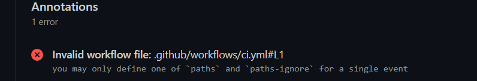
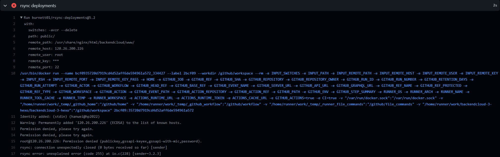
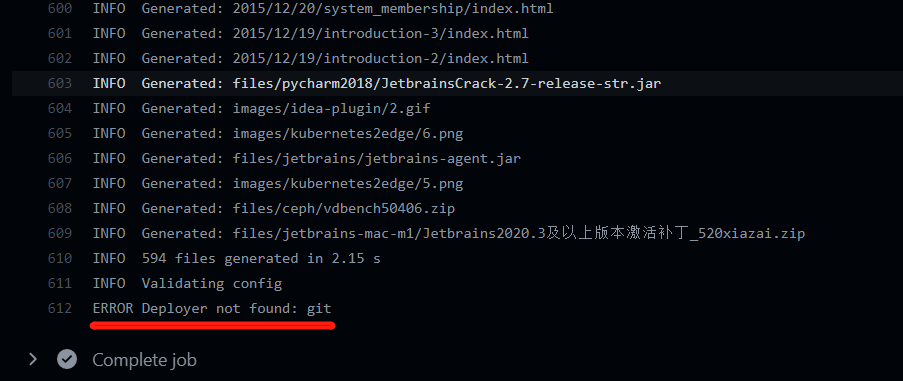
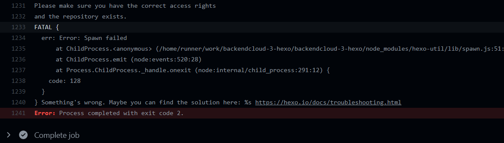
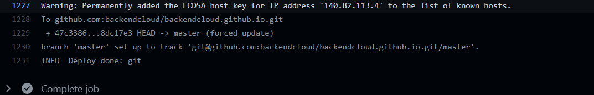
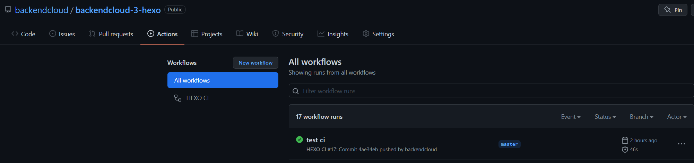
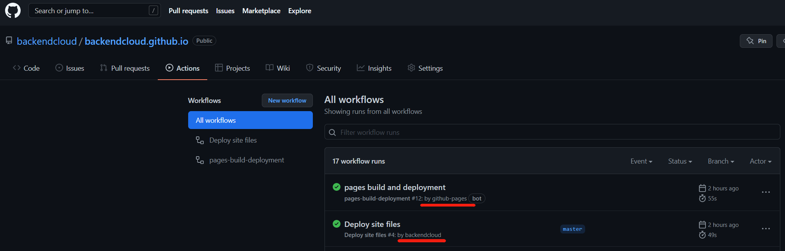

# backendcloud-3-hexo
https://github.com/backendcloud/backendcloud-3-hexo 是 https://www.backendcloud.cn/ 的hexo项目仓库。该仓库下的./public/文件不一定更新，只有用到下面的Github Action CICD流程的情况下会自动更新。

# backendcloud.github.io
https://github.com/backendcloud/backendcloud.github.io 是对应的静态html仓库。该仓库是Github Action CICD流程自动更新的。

# CICD方案升级

过去博客更新的方式是：执行`hexo g -d`进行打包部署，git版本管理push到Github。

自从上次试用过Github Action后，觉得应该紧跟技术趋势，用Github Action完成CICD自动化。其实事后效率也没提升，反而下降了，因为`hexo g -d`编译加部署一共一两秒。换成新流程只是省去了`hexo g -d`这一步，只剩下push到Github，但是Github Action自动执行这个过程大约需要30秒到60秒。

原来2秒就能看到博客更新的效果，现在要近1分钟才能看到。就是从方便程度，效率上没有优化，但是流程方式是极大升级的。该CICD思想用在大型项目上优势及其明显。且本地可以不用node环境，不需要装hexo。

自动化方案CICD流程升级：
1. Hexo代码仓库CI流程：监控到有push到静态目录public，则用rsync同步阿里云的nginx html目录。这种方案还需要本地执行`hexo g`。
2. Hexo代码仓库CI流程：监控到源文件文件夹有push，则部署node环境，安装hexo，安装本地包，执行`hexo g -d`，通过hexo rsync部署到阿里云的nginx html目录。
3. 终极方案，双代码仓库，hexo代码仓库和静态网页代码仓库。Hexo代码仓库CI流程：监控到源文件文件夹有push，则部署node环境，安装hexo，安装本地包，执行`hexo g -d`，通过hexo git部署到Github静态网页仓库并触发静态网页仓库的CI流程：通过rsync部署到阿里云的nginx html目录。

因为方案3已经包含了1和2的所有实现，所以就介绍下方案3。

# Hexo代码仓库CICD配置

```yaml
name: HEXO CI

#Invalid workflow file: .github/workflows/ci.yml#L1
#  you may only define one of `paths` and `paths-ignore` for a single event
on:
  push:
    branches:
      - master # 只在master上push触发部署
#    paths-ignore: # 下列文件的变更不触发部署，可以自行添加
#      - README.md
#      - LICENSE
    paths: # 这里是用来指定哪个文件更改，才会触发的
      - './source/_posts/**'

jobs:
  build:
    runs-on: ubuntu-latest
    strategy:
      matrix:
        node-version: [16.x]

    steps:
      - uses: actions/checkout@v1

      - name: Use Node.js ${{ matrix.node-version }}
        uses: actions/setup-node@v1
        with:
          node-version: ${{ matrix.node-version }}

      - name: Configuration environment
        env:
          HEXO_DEPLOY_PRI: ${{ secrets.DEPLOY_KEY }}
        run: |
          mkdir -p ~/.ssh/
          echo "$HEXO_DEPLOY_PRI" > ~/.ssh/id_rsa
          chmod 600 ~/.ssh/id_rsa
          ssh-keyscan github.com >> ~/.ssh/known_hosts
          git config --global user.name "hanwei"
          git config --global user.email "backendcloud@gmail.com"
      - name: Install dependencies
        run: |
          npm i -g hexo-cli
          npm i
          npm install hexo-deployer-git --save
      - name: Deploy hexo
        run: |
          hexo clean && hexo generate
          mkdir -p ./public/.github/workflows
          cp ./backendcloud.github.io.ci.yml ./public/.github/workflows/ci.yml
          hexo deploy
```

# 静态网页代码仓库CICD配置

```yaml
name: Deploy site files

on:
  push:
    branches:
      - master # 只在master上push触发部署
    paths-ignore: # 下列文件的变更不触发部署，可以自行添加
      - README.md
      - LICENSE

jobs:
  deploy:
    runs-on: ubuntu-latest # 使用ubuntu系统镜像运行自动化脚本

    steps: # 自动化步骤
      - uses: actions/checkout@v2 # 第一步，下载代码仓库

      - name: Deploy to Server # 第二步，rsync推文件
        uses: AEnterprise/rsync-deploy@v1.0 # 使用别人包装好的步骤镜像
        env:
          DEPLOY_KEY: ${{ secrets.DEPLOY_KEY }} # 引用配置，SSH私钥
          ARGS: -avz --delete --exclude='*.pyc' # rsync参数，排除.pyc文件
          SERVER_PORT: "22" # SSH端口
          FOLDER: ./ # 要推送的文件夹，路径相对于代码仓库的根目录
          SERVER_IP: ${{ secrets.SSH_HOST }} # 引用配置，服务器的host名（IP或者域名domain.com）
          USERNAME: root # 引用配置，服务器登录名
          SERVER_DESTINATION: /usr/share/nginx/html/backendcloud/www/ # 部署到目标文件夹
```

`Hexo git deploy`配置

```yaml
deploy:
  type: git
  repo: git@github.com:backendcloud/backendcloud.github.io.git
  # example, https://github.com/hexojs/hexojs.github.io
  branch: master
  ignore_hidden:
    public: false #public文件夹不忽略隐藏文件
```

# 跑通整个流程一路上遇到的坑
## paths-ignore 和 paths 不能同时存在。
```yaml
on:
  push:
    branches:
      - master # 只在master上push触发部署
    paths-ignore: # 下列文件的变更不触发部署，可以自行添加
      - README.md
      - LICENSE
    paths: # 这里是用来指定哪个文件更改，才会触发的
      - './source/_posts/**'
```



    Invalid workflow file: .github/workflows/ci.yml#L1
      you may only define one of `paths` and `paths-ignore` for a single event

## rsync use市场里选错了开源组件

burnett01/rsync-deployments@5.2 这个不知道哪里有问题


use换了一个：AEnterprise/rsync-deploy@v1.0 立马正常。

## hexo git找不到


需要在

```yaml
- name: Install dependencies
        run: |
          npm i -g hexo-cli
          npm i
      - name: Deploy hexo
        run: |
          hexo clean && hexo generate
```
加一条`npm install hexo-deployer-git --save`
```yaml
- name: Install dependencies
        run: |
          npm i -g hexo-cli
          npm i
          npm install hexo-deployer-git --save
      - name: Deploy hexo
        run: |
          hexo clean && hexo generate
```

## 推送到静态网页仓库没有权限


需要在对应的仓库的setting标签里，配置下公钥，该公钥需要和github action中的容器里的私钥一致。

## 推送到静态网页仓库正常，Github能看到最新的推送的代码仓库，但是该仓库的CI配置文件总是找不到


```yaml
      - name: Deploy hexo
        run: |
          hexo clean && hexo generate
          mkdir -p ./public/.github/workflows
          cp ./backendcloud.github.io.ci.yml ./public/.github/workflows/ci.yml
          hexo deploy
```

Hexo代码仓库的CI配置文件有写拷贝的命令，但是静态网页代码仓库总是找不到。调试了几次，确认了代码没有问题。试了非隐藏文件就能看到，隐藏文件就看不到。想到会不会hexo git默认就是不推送给隐藏文件的。去开源的hexo git查了下，果然。
> https://github.com/hexojs/hexo-deployer-git


`Hexo git deploy`配置从下面的

```yaml
deploy:
  type: git
  repo: git@github.com:backendcloud/backendcloud.github.io.git
  # example, https://github.com/hexojs/hexojs.github.io
  branch: master
```
改成
```yaml
deploy:
  type: git
  repo: git@github.com:backendcloud/backendcloud.github.io.git
  # example, https://github.com/hexojs/hexojs.github.io
  branch: master
  ignore_hidden:
    public: false #public文件夹不忽略隐藏文件
```
一切正常。
另外有个地方踩了个小坑：
这两句

    mkdir -p ./public/.github/workflows
    cp ./backendcloud.github.io.ci.yml ./public/.github/workflows/ci.yml

不能放在`hexo clean && hexo generate`之前，只能放在之后。因为hexo clean会清空`public`文件夹。

至此，双代码仓库的 三 Github Action CICD流程完全跑通。

