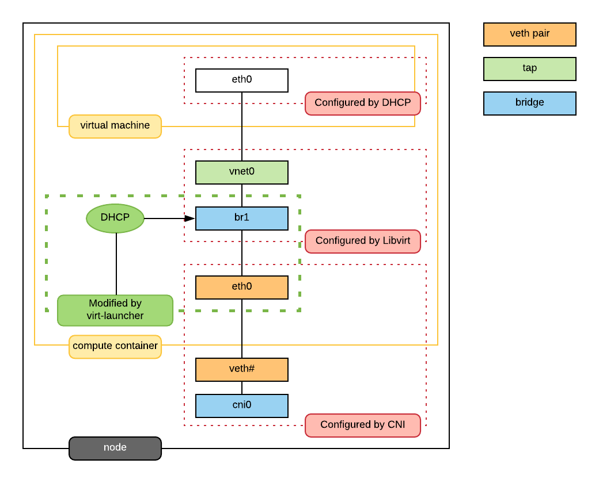

KubeVirt 是建立在 kubernetes 之上的，提供了容器和虚拟机的混部方案，其网络应该与 kubernetes 集成的，与 Pod 网络是互通的，KubeVirt 的 VMI 使用的应当是 Pod 的网络。为了实现该目标，KubeVirt 的对网络做了特殊实现。虚拟机具体的网络如下图所示， virt-launcher Pod 网络的网卡不再挂有 Pod IP，而是作为虚拟机的虚拟网卡的与外部网络通信的交接物理网卡。

虚拟机网络的启动需要以下几个步骤：

1. 通过 CNI 插件配置 libvirt 所在的 Pod 的网络
2. virt-launcher 记录 CNI 插件配置的接口信息（IP，routes，gateway，MAC），用于后续 DHCP 的配置
3. 将 Pod 的 eth0 网卡 ip 删除，设置接口状态为 down，修改 eth0 的 MAC 地址后重新启动 eth0
4. 创建后端为 bridge 的 libvirt 网络:
   * eth0 直接加入 bridge
   * 虚拟机网卡对应的 tap 口 也加入 bridge
   * bridge 配置 xx.xx.xx.xx 作为 DHCP server IP
   * virt-laucher ，启用 DHCP 功能，设置虚拟机网卡 MAC 地址和上面记录的 IP 地址的映射，使得虚拟机在启动时通过 DHCP 获取到 IP 地址
5. 虚拟机需要启用 dhclient，以自动获取 IP 地址