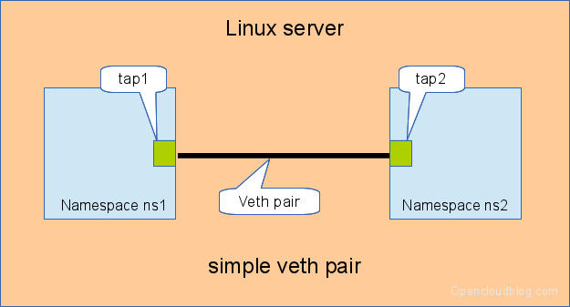
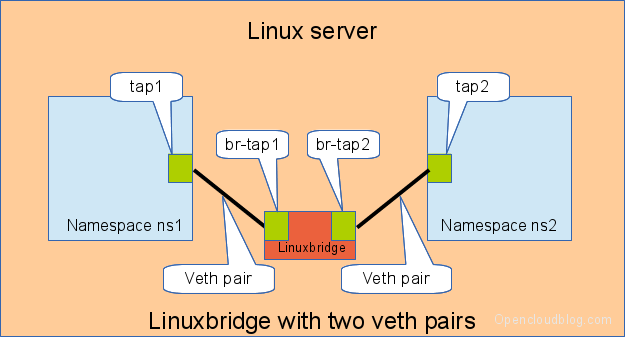
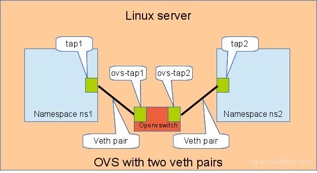
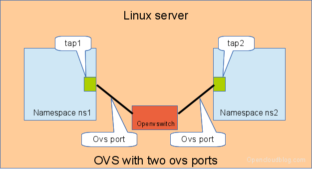

Switching in software on Linux is one of the important parts when using virtualization technologies like KVM or LXC. Typical hosts do not provide one or more physical adapters for each NIC of a virtual machine in KVM or per container when using LXC. Something else must take the part to interconnect the virtual network interfaces.

The software switching classical tool is the linuxbridge, which is available in the Linux kernel for a long time. The frontend to manage the linuxbridge is brctl. The newer tool is the Openvswitch (at http://openvswitch.org/). The main frontend is ovs-vsctl.

In this post I will show multiple solutions to interconnect Linux namespaces using a software based switch. A performance analysis of these solutions will be discussed in another article later. Starting with network namespaces helps to understand the more complex situations when using KVM or LXC.

# tap interfaces
Linux tap interfaces created with ip tuntap cannot be used to attach network namespaces to linuxbridges or the openvswitch.

# veth pair
The simple solution to connect two network namespaces is the usage of one veth pair. This has been discussed in a previous artice.



The command sequence has been discussed in a previous article, but we show the commands here again
```bash
# add the namespaces
ip netns add ns1
ip netns add ns2
# create the veth pair
ip link add tap1 type veth peer name tap2
# move the interfaces to the namespaces
ip link set tap1 netns ns1
ip link set tap2 netns ns2
# bring up the links
ip netns exec ns1 ip link set dev tap1 up
ip netns exec ns2 ip link set dev tap2 up
# now assign the ip addresses
```

# linux bridge and two veth pairs
When more than two network namespaces (or KVM or LXC instances) must be connected a switch should be used. Linux offers as one solution the well known linux bridge.



We need for this setup one switch, and two connectors. In this setup we use a linuxbridge and two veth pairs.

The commands to create this setup are:
```bash
# add the namespaces
ip netns add ns1
ip netns add ns2
# create the switch
BRIDGE=br-test
brctl addbr $BRIDGE
brctl stp   $BRIDGE off
ip link set dev $BRIDGE up
#
#### PORT 1
# create a port pair
ip link add tap1 type veth peer name br-tap1
# attach one side to linuxbridge
brctl addif br-test br-tap1
# attach the other side to namespace
ip link set tap1 netns ns1
# set the ports to up
ip netns exec ns1 ip link set dev tap1 up
ip link set dev br-tap1 up
#
#### PORT 2
# create a port pair
ip link add tap2 type veth peer name br-tap2
# attach one side to linuxbridge
brctl addif br-test br-tap2
# attach the other side to namespace
ip link set tap2 netns ns2
# set the ports to up
ip netns exec ns2 ip link set dev tap2 up
ip link set dev br-tap2 up
#
```

# openvswitch and two veth pairs
Another solution is to use the openvswitch instead of the „old“ linuxbrige. The configuration is nearly the same as for the linuxbridge.



We need for this setup one switch, and two connectors. In this setup we use an openvswitch and two veth pairs.

The commands to create this setup are:
```bash
# add the namespaces
ip netns add ns1
ip netns add ns2
# create the switch
BRIDGE=ovs-test
ovs-vsctl add-br $BRIDGE
#
#### PORT 1
# create a port pair
ip link add tap1 type veth peer name ovs-tap1
# attach one side to ovs
ovs-vsctl add-port $BRIDGE ovs-tap1
# attach the other side to namespace
ip link set tap1 netns ns1
# set the ports to up
ip netns exec ns1 ip link set dev tap1 up
ip link set dev ovs-tap1 up
#
#### PORT 2
# create a port pair
ip link add tap2 type veth peer name ovs-tap2
# attach one side to ovs
ovs-vsctl add-port $BRIDGE ovs-tap2
# attach the other side to namespace
ip link set tap2 netns ns2
# set the ports to up
ip netns exec ns2 ip link set dev tap2 up
ip link set dev ovs-tap2 up
#
```

# openvswitch and two openvswitch ports
Another solution is to use the openvswitch and make use of the openvswitch internal ports. This avoids the usage of the veth pairs, which must be used in all other solutions.



We need for this setup one switch, and two connectors. In this setup we use an openvswitch and two openvswitch ports.

The commands to create this setup are:
```bash
# add the namespaces
ip netns add ns1
ip netns add ns2
# create the switch
BRIDGE=ovs-test
ovs-vsctl add-br $BRIDGE
#
#### PORT 1
# create an internal ovs port
ovs-vsctl add-port $BRIDGE tap1 -- set Interface tap1 type=internal
# attach it to namespace
ip link set tap1 netns ns1
# set the ports to up
ip netns exec ns1 ip link set dev tap1 up
#
#### PORT 2
# create an internal ovs port
ovs-vsctl add-port $BRIDGE tap2 -- set Interface tap2 type=internal
# attach it to namespace
ip link set tap2 netns ns2
# set the ports to up
ip netns exec ns2 ip link set dev tap2 up
```