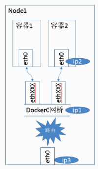
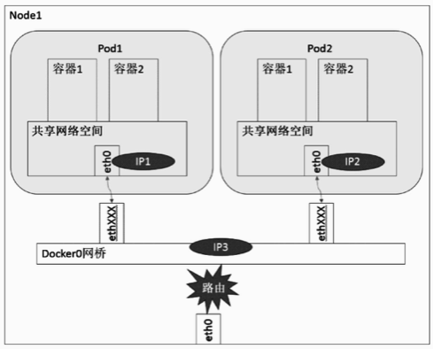
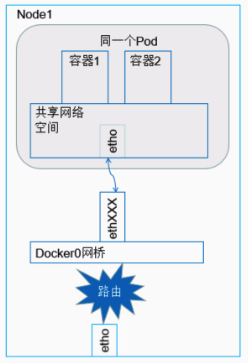
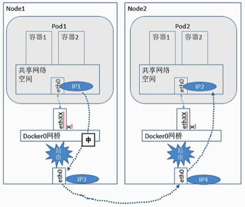

# Linux 网桥
网桥的作用，顾名思义，就是一个桥接的作用，桥接的对象是如果网络设备，目的是实现各网络中的主机之间的相互通信。

网桥是一个二层的虚拟网络设备，把若干个网络接口“连接”起来，以使得网络接口之间的报文能够互相转发，二层网络的转发依据就是网络设备的 MAC 地址。网桥能够解析收发的报文，读取目标 MAC 地址的信息，和自己记录的 MAC 表结合，来决策报文的转发目标网络接口。为了实现这些功能，网桥是具有自学习功能的，它会学习源 MAC 地址。在转发报文时，网桥只需要向特定的网口进行转发，来避免不必要的网络交互。如果它遇到一个自己从未学习到的地址，就无法知道这个报文应该向哪个网络接口转发，就将报文广播给所有的网络接口（报文来源的网络接口除外），其中，为了适应网络拓扑的变化，网桥学习到的 MAC 地址表是有过期时间的，长时间北邮收到对应 MAC 回发的包，就认为设备已经不在那个转发端口上了，下一次给这个 MAC 的包就会以广播的形式转发。

Linux内核是通过一个虚拟的网桥设备（Net Device）来实现桥接的。这个虚拟设备可以绑定若干个以太网接口设备，从而将它们桥接起来，这种 Net Device 网桥和普通的设备不同，最明显的一个特性是它还可以有一个IP地址。这里说 Linux 网桥和传统的交换机概念还不能划等号，因为交换机是个单纯的二层设备，对于报文的操作要么转发要么丢弃，而 Linux 网桥除此之外，还有可能会将报文送至协议栈上层，即网络层，因此 Linux 网桥既可以看作二层设备，又可以看作三层设备。

# Linux 路由
Linux 系统包含一个完整的路由功能。当 IP 层在处理数据发送或者转发时，会使用路由表来决定发往哪里。在通常情况下，如果主机与目的主机直接相连，那么主机可以直接发送IP报文到目的主机，这个过程比较简单。例如，通过点对点的链接或网络共享，如果主机与目的主机没有直接相连，那么主机会将 IP 报文发送给默认的路由器，然后由路由器来决定往哪里发送IP报文。 路由功能由 IP 层维护的一张路由表来实现。当主机收到数据报文时，它用此表来决策接下来应该做什么操作。当从网络侧接收到数据报文时，IP 层首先会检查报文的 IP 地址是否与主机自身的地址相同。如果数据报文中的 IP 地址是主机自身的地址，那么报文将被发送到传输层相应的协议中。如果报文中的 IP 地址不是主机自身的地址，并且主机配置了路由功能，那么报文将被转发，否则，报文将被丢弃。

# Docker bridge 网络实现
Docker 支持下列四种网络模式：bridge 模式（默认）、none 模式、host 模式、container 模式。由于目前涉及到容器云运维的工作都是以 Kubernetes 为核心，而 Docker 的这四种网络通信模式中只有 bridge 模式在 Kubernetes 中被用到，因此主要是介绍一下 Docker 的 bridge 网络模式。

Docker 默认为容器采用 bridge 网络模式。在 bridge 模式下，Docker Daemon 首次启动时会创建一个虚拟的网桥，默认的名称是 docker0，然后在私有网络空间中给这个网桥分配一个子网（通常 IP 以 172 开头）。针对由Docker创建的每一个容器，都会创建一个之前讲的 Veth 设备对，其中一端关联到网桥上，另一端使用 Linux 的 Network Namespace 技术，映射到容器内的 eth0 (Veth) 设备，然后从网桥的地址段内给eth0接口分配一个IP地址，相应的 MAC 地址也根据这个 IP 地址进行相应的生成操作。（是的，你没看错，可以分配 IP…所以说不要当作是交换机）

经过 bridge 桥接之后，在同一台主机内的容器之间可以相互通信，不同主机上的容器暂时还不能相互通信，实际上它们甚至有可能在相同的网络地址范围内（不同主机上的docker0的地址段可能是一样的）。

# 相同 Node 下 Pod 间通信

同上面的Docker网络实现，区别就是 Pod 是 Kubernetes 中最基本的调度单位，而不是 Docker 容器，Pod 的本意是豆荚，可以将容器理解为豆荚中的豆子，一个 Pod 可以包含多个有关联关系的容器，之后讨论的 Pod 与 Service 的通信也是从 Pod 层面而言的。这是必须要提前认识的概念，但是在底层，还是涉及到容器之间的通信，毕竟 Pod 只是一个抽象概念。

同一个 Pod 内的容器不会跨主机通信，它们共享同一个 Network Namesapce 空间，共享同一个 Linux 协议栈。所以对于网络的各类操作，因此可以把一个 Pod 视作一个独立的「主机」，内部的容器可以用 localhost 地址访问彼此的端口。这么做的结果是简单、安全和高效，也能减小将已经存在的程序从物理机或者虚拟机移植到容器下运行的难度。

如图，Node 上运行着一个 Pod 实例，Pod 内部的容器共享同一个 Network Namespace，因此容器1和容器2之间的通信非常简单，就可以通过直接的本地 IPC 方式通信，对于网络应用，可以直接通过 localhost 访问指定端口通信。因此对于一些传统程序想要移植到 Pod 中，几乎不需要做太多的修改。

# 不同 Node 下 Pod 间通信
在同一个 Node 下的 Pod 间通信因为可以直接通过 docker0 桥接实现，因此很容易理解，但是在不同 Node 下的 Pod 间通信如何实现就是个很有学问的事情了。

首先我们要知道的是，每个宿主机上 docker0 网桥为 Pod 分配的都是私有 IP，而 Kubernetes 要求网络对 Pod 的地址是平面且直达的，说白了就是在集群中可以通过 Pod 的私有 IP 在各个不同 Node 之间通信。因此我们可以知道，对于 Pod IP 的规划是非常重要的，要实现上面讲的可以在集群内部使用私有 IP 进行不同 Node 间的 Pod 通信，最起码要保证在集群层面这些私有 IP 一定是不冲突的才行，注意，这些 Pod 私有 IP 是保存在 Etcd 集群中的。

另外，我们知道，不同 Node 之间的通信一定是要经由宿主机的物理网卡，因此要实现 Pod 在不同 Node 之间的通信，还要通过 Node 的 IP 进行寻址和通信，这也是需要关注的一点。

综上我们可知，对于不同 Node 下的 Pod 间通信，核心是满足两点：

* Pod IP 实现集群层级的不冲突。Pod 的 IP 分配虽然是有本地 docker0 负责，但是具体的地址规划一定是要在集群层面，保证其不冲突，这是通过私有 Pod IP 跨 Node 通信的基本条件；
* Pod IP 借助 Node IP 进行寻址访问。Node 之间通信的桥梁还是 Node 实实在在的物理网卡，因此需要找到一种方法，将 Pod IP 与 Node IP 关联起来，通过这个关联实现不同 Node 的 Pod 之间的访问。

