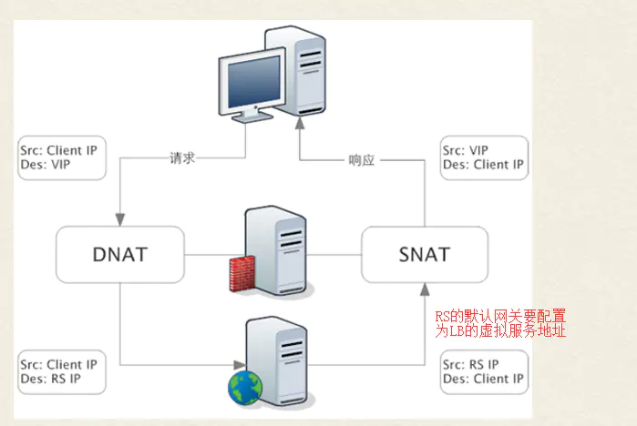

# kube-proxy 运行机制
为了支持集群的水平扩展、高可用性，Kubernetes抽象出了Service的概念。Service是对一组Pod的抽象，它会根据访问策略（如负载均衡策略）来访问这组Pod。 Kubernetes在创建服务时会为服务分配一个虚拟的IP地址，客户端通过访问这个虚拟的IP地址来访问服务，服务则负责将请求转发到后端的Pod上。起到一个类似于反向代理的作用，但是它和普通的反向代理还是有一些不同：首先，它的Service 的 IP 地址，也就是所谓的 ClusterIP 是虚拟的，想从外面访问还需要一些技巧；其次，它的部署和启停是由Kubernetes统一自动管理的。

Service 和 Pod 一样，其实仅仅是一个抽象的概念，背后的运作机制是依赖于 kube-proxy 组件实现的。

在 Kubernetes 集群的每个 Node 上都会运行一个 kube-proxy 服务进程，我们可以把这个进程看作 Service 的透明代理兼负载均衡器，其核心功能是将到某个 Service 的访问请求转发到后端的多个 Pod 实例上。此外，Service的Cluster IP与 NodePort 等概念是 kube-proxy 服务通过iptables的NAT转换实现的，kube-proxy 在运行过程中动态创建与 Service 相关的 iptables 规则，这些规则实现了将访问服务（Cluster IP或NodePort）的请求负载分发到后端 Pod 的功能。由于 iptables 机制针对的是本地的 kube-proxy 端口，所以在每个 Node 上都要运行 kube-proxy 组件，这样一来，在 Kubernetes 集群内部，我们可以在任意 Node 上发起对 Service 的访问请求。综上所述，由于 kube-proxy 的作用，在 Service 的调用过程中客户端无须关心后端有几个 Pod，中间过程的通信、负载均衡及故障恢复都是透明的。

# kube-proxy 运行模式
kube-proxy 的具体运行模式其实是随着 Kubernetes 版本的演进有着较大的变化的，整体上分为以下几个模式的演化：
* userspace (用户空间代理)模式
* iptables 模式
* IPVS 模式

## userspace 模式

kube-proxy 最早的工作模式便是 userspace 用户空间代理模式，在这种模式下 kube-proxy 是承担着真实的 TCP/UDP 代理任务的，当 Pod 通过 Cluster IP 访问 Service 的时候，流量被 iptables 拦截后转发到节点的 kube-proxy 进程，服务的路由信息通过 watch API Server 进行获取，然后 kube-proxy 进程再与具体的 Pod 建立 TCP/UDP 连接，从而将请求发送给 Service 的后端 Pod 上，在这个过程中实现负载均衡。

## iptables 模式

从 kubernetes 1.2 版本开始不再采用 userspace 用户空间代理模式，取而代之的是 iptables 模式，在 iptables 模式下 kube-proxy 不再担任直接的 proxy 作用，它的核心职责变为：一方面通过 watch API Server 实时获取 Service 与 Endpoint 的变更信息，然后动态地更新 iptables 规则，然后流量会根据 iptables 的 NAT 机制直接路由到目标 Pod，而不是再去单独建立连接。


与之前的 userspace 模式相比，iptables 模式完全工作在内核态，不需要切换到用户态的 kube-proxy，避免了内核态用户态的频繁切换使得性能相比之前有所提高。

但是 iptables 也存在着局限性，就是由于 iptables 客观因素，当 Kubernetes 集群规模扩大，Pod 数量大量增加之后，iptables 的规则数量会随之急剧增加，进而导致其转发性能的下降，甚至会出现规则丢失的情况（故障非常难以重现和排查），因此 iptables 模式也有待于改进。

## IPVS 模式

IPVS 模式即 IP Virtual Server 模式，在 Kubernetes 1.11中 IPVS 模式升级为 GA，IPVS 虽然和 iptables 都是基于 Netfilter 实现，但是定位有着本质不同，iptables 设计为防火墙使用，而 IPVS 用于高性能负载均衡，而且从规则的存储角度，IPVS 采用的是 Hash Table 结构，因此理论上讲更适合在不影响性能的情况下大规模地扩展，同时 IPVS 支持比 iptables 更复杂的负载均衡算法（最小负载/最小连接数/加权等），支持服务器健康检查和连接重试等功能，另外还可以动态修改 ipset 集合。


在 IPVS 模式下，并不是就直接抛弃 iptables 了，虽然 IPVS 在性能上肯定是要优于 iptables 的，但同时也有许多功能 IPVS 相比 iptables 是缺失的，比如包过滤、地址伪装、SNAT 等功能，因此在一些场景下是需要 IPVS 与 iptables 配合工作的，比如 NodePort 实现。同时在 IPVS 模式下，kube-proxy 使用的是 iptables 的扩展 ipset，而不是直接通过 iptables 生成规则链。iptables 规则链是线性的数据结构，而 ipset 是带索引的数据结构，因此当规则很多时，可以高效地匹配查找。

# iptable基础知识

Linux 网络协议栈非常高效，同时比较复杂。如果我们希望在数据的处理过程中对关心的数据进行一些操作，则该怎么做呢？Linux 提供了一套机制来为用户实现自定义的数据包处理过程。在 Linux 网络协议栈中有一组回调函数挂接点，通过这些挂接点挂接的钩子函数可以在 Linux 网络栈处理数据包的过程中对数据包进行一些操作，例如过滤、修改、丢弃等。整个挂接点技术叫作 Netfilter 和 iptables。

Netfilter 与 iptables 不是两个独立的组件，Netfilter 是一个位于内核空间的防火墙框架，而 iptables 可以认为是一个位于用户空间的客户端。

Netfilter 的核心功能就是数据包过滤、数据包修改、网络地址转换（NAT）


## 规则概念
iptables 最核心的概念是 Rules，即规则，一句话概括其工作逻辑就是“对于匹配到规则的数据包执行预先指定好的逻辑”。这里涉及到几个概念，首先是匹配，从字面上很好理解，匹配就是看对不对的上号，对于 iptables 而言，它面对的是数据包，因此它要匹配的自然是与数据包相关的信息，比如源地址、目的地址、传输协议、服务类型，只有当这些可以匹配的时候，才执行一些规则逻辑，比如放行、拒绝、丢弃等。

## 五链
或许你对 iptables 具体是做什么的，怎么工作的并不熟悉，但是当你听到一个内行来讲 iptables 的时候，他一定会提到“四表五链”，那么什么是 iptables 的四表无链？他们又有什么作用呢？

首先说“链”，这里的链指的是“规则链”，即在 iptables 的工作过程中，并不是只通过一条规则来处理数据包的，而是有许多规则，这些规则按照一定的顺序排列起来，报文经过 iptables 时就要对着一些规则一条一条进行匹配，执行相应的动作，我们把这种一系列的规则看作是一种串联，则称为是“链”。

比如以其中一条称作 PREROUTING 的链来看，它的内部结构是这样的：


数据包会在这条链里经过很多条的规则匹配，如果该数据包不符合链中任一条规则，iptables就会根据预先定义的默认策略来处理数据包。

在 iptables 中存在着如下五条链：


* PREROUTING 链：路由选择前；
* INPUT 链：路由目的地为本机；
* FORWARD 链：路由目的地非本机，转发；
* OUTPUT 链：本机发出数据包；
* POSTROUTING 链：路由选择后；

## 四表
知道了五链之后，接下来看四表，如果说链是表现的是一系列规则的执行顺序关系，那么表则是表现的一系列规则的功能逻辑关系，我们把具有相同功能的规则集合称为“表”，因为我们会发现有时在不同的链上执行的规则它们之间是有内在关联的，或是对数据的过滤，或是对报文数据的修改等等，iptables 为我们提供了如下的规则分类：

* Filter 表：iptables 默认表，负责包过滤，防火墙功能；
* NAT 表：负责网络地址转换功能，对应内核模块；
* Mangle 表：主要负责修改数据包，对应内核模块；
* Raw 表：优先级最高，关闭 NAT 表启用的连接追踪机制；
  注意这些表是有优先级之分的，优先级高到低：raw–>mangle–>nat–>filter

链与表的对应也不是随随便便的，有些表的规则只有对应链上可能存在，具体的链表对应关系如下：：
* PREROUTING 链：raw表，mangle表，nat表。
* INPUT 链：mangle表，filter表，（centos7中还可以有nat表）
* FORWARD 链：mangle表，filter表。
* OUTPUT 链：raw表mangle表，nat表，filter表。
* POSTROUTING 链：mangle表，nat表。


## 再看规则
一开始只是提到了规则这个概念，那么规则的匹配和规则逻辑该如何定义和进行呢？

匹配条件

分为基本匹配条件和扩展匹配条件

* 基本匹配条件：源 IP，目标 IP；
* 扩展匹配条件：除了上述的条件可以用于匹配，还有很多其他的条件可以用于匹配，这些条件泛称为扩展条件，如源端口，目的端口等；

规则逻辑

规则逻辑在 iptables 中称为 target，常见的一些处理逻辑如下：

* ACCEPT：允许数据包通过；
* DROP：直接丢弃数据包；
* REJECT：拒绝数据包；
* SNAT：源地址转换，可以解决内网用户用同一个公网地址上网的问题；
* DNAT：目标地址转换；
* MASQUERADE：是SNAT的一种特殊形式，适用于动态的、临时会变的ip上；
* REDIRECT：在本机做端口映射；
* MARK：数据包打标记；

注意：
1. 目标地址转换一般在 PREROUTING 链上操作
2. 源地址转换一般在 POSTROUTING 链上操作

## 总结
1、当主机收到一个数据包后，数据包先在内核空间中处理，若发现目的地址是自身，则传到用户空间中交给对应的应用程序处理，若发现目的不是自身，则会将包丢弃或进行转发。
2、iptables实现防火墙功能的原理是：在数据包经过内核的过程中有五处关键地方，分别是PREROUTING、INPUT、OUTPUT、FORWARD、POSTROUTING，用户可以在这五条链上编写 Rules，对经过的数据包进行处理，规则一般的定义为“如果数据包头符合这样的条件，就这样处理数据包”。
3、iptables中定义有5条链，每条链中可以定义多条 Rules，每当数据包到达一条链时，iptables就会从链上第一条规则开始匹配，看该数据包是否满足规则所定义的条件。如果满足，系统就会根据该条规则所定义的规则逻辑（称为 target）处理该数据包；否则 iptables 将继续检查下一条规则，如果该数据包不符合链中任一条规则，iptables就会根据预先定义的默认策略来处理数据包；
4、iptables中定义有表，分别表示提供的功能，有filter表（实现包过滤）、nat表（实现网络地址转换）、mangle表（实现包修改）、raw表（实现数据跟踪），这些表具有一定的优先级：raw–>mangle–>nat–>filter

# Linux负载均衡--LVS（IPVS）

## LVS简介

LVS是Linux Virtual Server的简称，也就是Linux虚拟服务器, 是一个由章文嵩博士发起的自由软件项目，现在已经是 Linux标准内核的一部分。LVS是一种叫基于TCP/IP的负载均衡技术，转发效率极高，具有处理百万计并发连接请求的能力。

LVS的IP负载均衡技术是通过IPVS模块实现的。IPVS模块是LVS集群的核心软件模块，它安装在LVS集群作为负载均衡的主节点上，虚拟出一个IP地址和端口对外提供服务。用户通过访问这个虚拟服务（VS），然后访问请求由负载均衡器（LB）调度到后端真实服务器（RS）中，由RS实际处理用户的请求给返回响应。


## IPVS的三种转发模式
根据负载均衡器转发客户端请求以及RS返回响应机制的不同，将IPVS的转发模式分为三种：NAT，DR，FULLNAT。（还有一种IP TUNNEL模式，IP通道技术，接触比较少）

### 1. DR模式（Direct Routing）
DR模式下，客户端的请求包到达负载均衡器的虚拟服务IP端口后，负载均衡器不会改写请求包的IP和端口，但是会改写请求包的MAC地址为后端RS的MAC地址，然后将数据包转发；真实服务器处理请求后，响应包直接回给客户端，不再经过负载均衡器。所以DR模式的转发效率是最高的，特别适合下行流量较大的业务场景，比如请求视频等大文件。

DR模式的特点：

数据包在LB转发过程中，源/目的IP端口都不会变化

LB只是将数据包的MAC地址改写为RS的MAC地址，然后转发给相应的RS。

每台RS上都必须在环回网卡上绑定LB的虚拟服务IP

因为LB转发时并不会改写数据包的目的IP，所以RS收到的数据包的目的IP仍是LB的虚拟服务IP。为了保证RS能够正确处理该数据包，而不是丢弃，必须在RS的环回网卡上绑定LB的虚拟服务IP。这样RS会认为这个虚拟服务IP是自己的IP，自己是能够处理这个数据包的。否则RS会直接丢弃该数据包！

RS上的业务进程必须监听在环回网卡的虚拟服务IP上，且端口必须和LB上的虚拟服务端口一致

因为LB不会改写数据包的目的端口，所以RS服务的监听端口必须和虚拟服务端口一致，否则RS会直接拒绝该数据包。

RS处理完请求后，响应直接回给客户端，不再经过LB

因为RS收到的请求数据包的源IP是客户端的IP，所以理所当然RS的响应会直接回给客户端，而不会再经过LB。这时候要求RS和客户端之间的网络是可达的。

LB和RS须位于同一个子网

因为LB在转发过程中需要改写数据包的MAC为RS的MAC地址，所以要能够查询到RS的MAC。而要获取到RS的MAC，则需要保证二者位于一个子网，否则LB只能获取到RS网关的MAC地址。


### 2. NAT模式（Network Address Translation）
NAT模式下，请求包和响应包都需要经过LB处理。当客户端的请求到达虚拟服务后，LB会对请求包做目的地址转换（DNAT），将请求包的目的IP改写为RS的IP。当收到RS的响应后，LB会对响应包做源地址转换（SNAT），将响应包的源IP改写为LB的IP。

NAT模式的特点：

LB会修改数据包的地址

对于请求包，会进行DNAT；对于响应包，会进行SNAT。

LB会透传客户端IP到RS（DR模式也会透传）

虽然LB在转发过程中做了NAT转换，但是因为只是做了部分地址转发，所以RS收到的请求包里是能看到客户端IP的。

需要将RS的默认网关地址配置为LB的浮动IP地址

因为RS收到的请求包源IP是客户端的IP，为了保证响应包在返回时能走到LB上面，所以需要将RS的默认网关地址配置为LB的虚拟服务IP地址。当然，如果客户端的IP是固定的，也可以在RS上添加明细路由指向LB的虚拟服务IP，不用改默认网关。

LB和RS须位于同一个子网，并且客户端不能和LB/RS位于同一子网

因为需要将RS的默认网关配置为LB的虚拟服务IP地址，所以需要保证LB和RS位于同一子网。

又因为需要保证RS的响应包能走回到LB上，则客户端不能和RS位于同一子网。否则RS直接就能获取到客户端的MAC，响应包就直接回给客户端了，不会走网关，也就走不到LB上面了。这时候由于没有LB做SNAT，客户端收到的响应包源IP是RS的IP，而客户端的请求包目的IP是LB的虚拟服务IP，这时候客户端无法识别响应包，会直接丢弃。



### 3. FULLNAT模式
FULLNAT模式下，LB会对请求包和响应包都做SNAT+DNAT。

FULLNAT模式的特点：

LB完全作为一个代理服务器

FULLNAT下，客户端感知不到RS，RS也感知不到客户端，它们都只能看到LB。此种模式和七层负载均衡有点相似，只不过不会去解析应用层协议，而是在TCP层将消息转发

LB和RS对于组网结构没有要求

不同于NAT和DR要求LB和RS位于一个子网，FULLNAT对于组网结构没有要求。只需要保证客户端和LB、LB和RS之间网络互通即可。


三种转发模式性能从高到低：DR > NAT >FULLNAT。

虽然FULLNAT模式的性能比不上DR和NAT，但是FULLNAT模式没有组网要求，允许LB和RS部署在不同的子网中，这给运维带来了便利。并且 FULLNAT模式具有更好的可拓展性，可以通过增加更多的LB节点，提升系统整体的负载均衡能力。


## IPVS支持的调度算法
对于后端的RS集群，LB是如何决策应该把消息调度到哪个RS节点呢？这是由负载均衡调度算法决定的。IPVS常用的调度算法有：

静态方法

仅依据算法本身进行轮询调度

* RR： Round Robin，轮调， 一个接一个，自上而下
* WRR： Weighted RR，加权论调， 加权，手动让能者多劳。
* SH： SourceIP Hash，来自同一个IP地址的请求都将调度到同一个RealServer
* DH： Destination Hash，不管IP，请求特定的东西，都定义到同一个RS上

动态方法

根据算法及RS的当前负载状态进行调度

* LC： least connections(最小链接数) 链接最少，也就是Overhead最小就调度给谁。 假如都一样，就根据配置的RS自上而下调度。 overhead=active*256+inactiveconns
* WLC： Weighted Least Connection (加权最小连接数) 这个是LVS的默认算法。 overhead=(activeconns*256+inactiveconns)/weight
* SED： Shortest Expection Delay(最小期望延迟) WLC算法的改进。 overhead=(activeconns+1)*256/weight
* NQ： Never Queue SED算法的改进。第一次均匀分配,后续SED
* LBLC： Locality-Based Least-Connection,基于局部的的LC算法 正向代理缓存机制。访问缓存服务器，调高缓存的命中率。 和传统DH算法比较，考虑缓存服务器负载。可以看做是DH+LC 如果有两个缓存服务器
* 只要调度到其中的一个缓存服务器，那缓存服务器内就会记录下来。下一次访问同一个资源的时候也就是这个服务器了。 (DH)
* 有一个用户从来没有访问过这两个缓存服务器，那就分配到负载较小的服务器。LC
* LBLCR： Locality-Based Least-Connection with Replication(带复制的lblc算法) 缓存服务器中的缓存可以互相复制。 因为即使没有，也能立即从另外一个服务器内复制一份，并且均衡负载

# 为什么要在Kubernetes中使用IPVS
随着Kubernetes使用率的增长，其资源的可扩展性变得越来越重要。特别是服务的可扩展性对于开发者和那些有高负载的公司对Kubernetes的接纳程度来说是非常重要的。

Kube-proxy作为服务路由（Service routing）的构建块一直依赖于久经沙场的iptables来实现对核心服务类型（ClusterIP和NodePort）的支持。但是，iptables在对10000以上的Service的扩展性支持上显得非常的挣扎，因为iptables本身是为防火墙而设计的，并基于内部的（in-kernel）规则列表。

在Kubernetes 1.6的时候， 它已经可以支持5000个节点，导致这个数量的实际瓶颈就是kube-proxy中的iptables。举例来说，在一个5000节点的集群中全部使用NodePort类型的的service，如果我们创建2000个services，每个service对应10个pods，这将使每个节点上生成至少20000条记录，从而导致内核相当繁忙。

相对来说，使用基于IPVS的集群服务负载均衡就对这种情景游刃有余的多了。IPVS是专门为负载均衡而设计的，并使用了更高效的数据结构（hash tables），从而在底层几乎具有无限的可扩展性。

# Kubernetes中IPVS Service网络拓扑
当创建一个ClusterIP类型的Service时， IPVS proixer做了以下三件事：

确保节点上存在虚拟接口，默认为kube-ipvs0
```bash
[root@master ~]# ip addr
...
8: kube-ipvs0: <BROADCAST,NOARP> mtu 1500 qdisc noop state DOWN group default
link/ether 4a:4e:8d:52:b0:3b brd ff:ff:ff:ff:ff:ff
...
```

把Service IP绑定到虚拟接口上
```bash
[root@master ~]# kubectl describe svc kubernetes
Name:              kubernetes
Namespace:         default
Labels:            component=apiserver
provider=kubernetes
Annotations:       <none>
Selector:          <none>
Type:              ClusterIP
IP:                10.96.0.1
Port:              https  443/TCP
TargetPort:        6443/TCP
Endpoints:         192.168.56.101:6443
Session Affinity:  None
Events:            <none>

[root@master ~]# ip addr
...
8: kube-ipvs0: <BROADCAST,NOARP> mtu 1500 qdisc noop state DOWN group default
link/ether 4a:4e:8d:52:b0:3b brd ff:ff:ff:ff:ff:ff
inet 10.96.0.1/32 brd 10.96.0.1 scope global kube-ipvs0
valid_lft forever preferred_lft forever
...
```

为每个Service IP单独创建IPVS virtual servers
```bash
[root@master ~]# ipvsadm -ln
IP Virtual Server version 1.2.1 (size=4096)
Prot LocalAddress:Port Scheduler Flags
-> RemoteAddress:Port           Forward Weight ActiveConn InActConn
...
TCP  10.96.0.1:443 rr
-> 192.168.56.101:6443          Masq    1      4          0         
...
```
