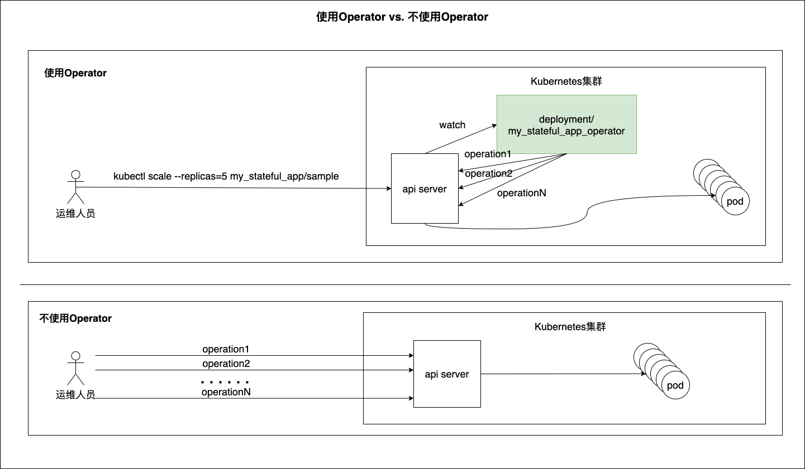

> 可将 Operator 看成管理 Kubernetes 中这类应用程序的运行时。

kubernetes operator的概念最初来自CoreOS – 一家被红帽(redhat)收购的容器技术公司。

CoreOS在引入Operator概念的同时，也给出了Operator的第一批参考实现：etcd operator和prometheus operator。

CoreOS对Operator这一概念的诠释是：Operator在软件中代表了人类的运维操作知识，通过它可以可靠地管理一个应用程序。

通过这张图，即便对operator不甚了解，也能大致感受到operator的优点吧。

在没有使用operator的情况下，运维人员需要对有状态应用的伸缩的操作步骤有深刻的认知，并按顺序逐个执行一个命令序列中的命令并检查命令响应，遇到失败的情况时还需要进行重试，直到伸缩成功。

我们看到operator就好比一个内置于k8s中的经验丰富运维人员，时刻监控目标对象的状态，把复杂性留给自己，给运维人员一个简洁的交互接口，同时operator也能降低运维人员因个人原因导致的操作失误的概率。

从头写一个operator很复杂几乎无人这么做，大多数开发者都会去学习相应的开发框架与工具，比如：kubebuilder、operator framework sdk。

# client-go

ClientSet VS DynamicClient
类型化 ClientSets 使得使用预先生成的本地 API 对象与 API 服务器通信变得简单，从而获得类似 RPC 的编程体验。类型化客户端使用程序编译来强制执行数据安全性和一些验证。然而，在使用类型化客户端时，程序被迫与所使用的版本和类型紧密耦合。

而 DynamicClient 则使用 unstructured.Unstructured 表示来自 API Server 的所有对象值。Unstructured 类型是一个嵌套的 map[string]inferface{} 值的集合来创建一个内部结构，该结构和服务端的 REST 负载非常相似。

DynamicClient 将所有数据绑定推迟到运行时，这意味着程序运行之前，使用 DynamicClient 的的程序将不会获取到类型验证的任何好处。对于某些需要强数据类型检查和验证的应用程序来说，这可能是一个问题。

然而，松耦合意味着当客户端 API 发生变化时，使用 DynamicClient 的程序不需要重新编译。客户端程序在处理 API 表面更新时具有更大的灵活性，而无需提前知道这些更改是什么。
