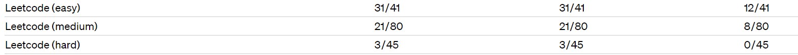
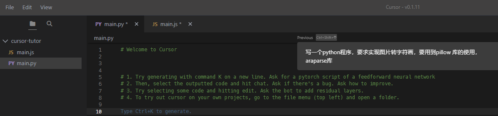
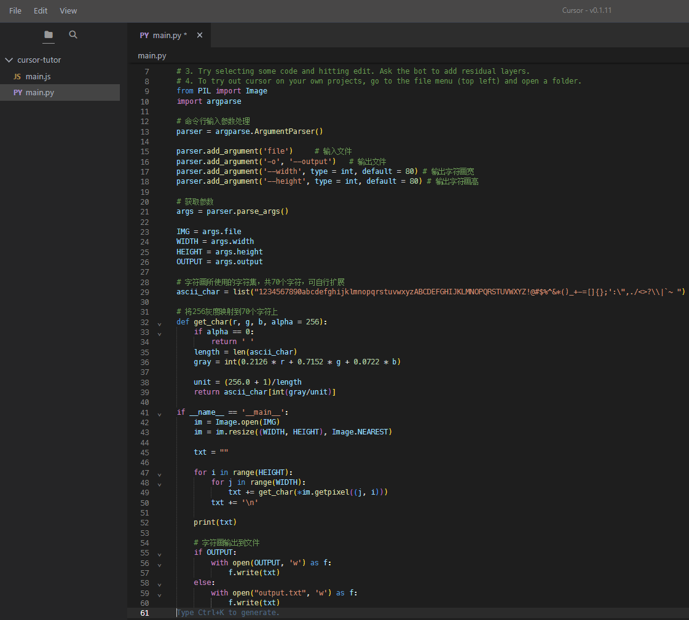
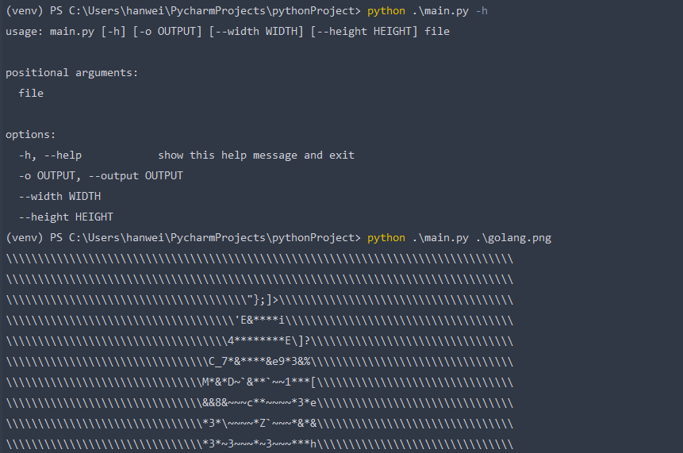
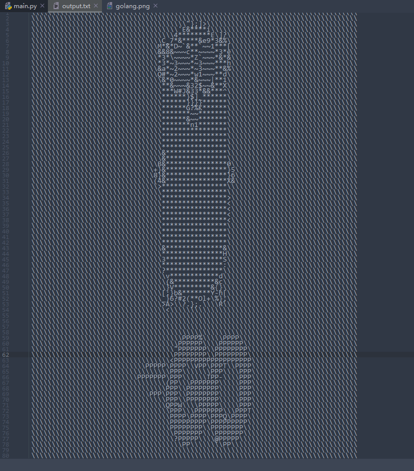

GPT-4和GPT-3.5在处理和编写代码的能力上差别还是很大的。官网的一份测试报告。



前两个是GPT-4，一个采用文本输入，一个采用图像输入；第三个是GPT3.5，可以看出GPT-4的代码能力相较于GPT-3.5有较大能力的提升。

集成GPT-4的Github Copilot X还在小范围内测中，而集成GPT-4的Cursor已公开发行。Cursor是一个集成GPT-4的IDE，可以用自然语言编写代码，让编写代码和聊天一样简单。

集成GPT-4的Cursor，快捷键：windows电脑 ctrl+k，mac comand+k 唤起需求输入框，来用自然语言编写代码；ctrl+l，mac comand+l 唤起聊天窗口，让编写代码和聊天一样简单。

首先，按下 ctrl+k。写下一段需求：写一个python程序，要求实现图片转字符画并写入文件，要用到pillow 库的使用，araparse库





```python
# Welcome to Cursor


# 1. Try generating with command K on a new line. Ask for a pytorch script of a feedforward neural network
# 2. Then, select the outputted code and hit chat. Ask if there's a bug. Ask how to improve.
# 3. Try selecting some code and hitting edit. Ask the bot to add residual layers.
# 4. To try out cursor on your own projects, go to the file menu (top left) and open a folder.
from PIL import Image
import argparse

# 命令行输入参数处理
parser = argparse.ArgumentParser()

parser.add_argument('file')     # 输入文件
parser.add_argument('-o', '--output')   # 输出文件
parser.add_argument('--width', type = int, default = 80) # 输出字符画宽
parser.add_argument('--height', type = int, default = 80) # 输出字符画高

# 获取参数
args = parser.parse_args()

IMG = args.file
WIDTH = args.width
HEIGHT = args.height
OUTPUT = args.output

# 字符画所使用的字符集，共70个字符，可自行扩展
ascii_char = list("1234567890abcdefghijklmnopqrstuvwxyzABCDEFGHIJKLMNOPQRSTUVWXYZ!@#$%^&*()_+-=[]{};':\",./<>?\\|`~ ")

# 将256灰度映射到70个字符上
def get_char(r, g, b, alpha = 256):
    if alpha == 0:
        return ' '
    length = len(ascii_char)
    gray = int(0.2126 * r + 0.7152 * g + 0.0722 * b)

    unit = (256.0 + 1)/length
    return ascii_char[int(gray/unit)]

if __name__ == '__main__':
    im = Image.open(IMG)
    im = im.resize((WIDTH, HEIGHT), Image.NEAREST)

    txt = ""

    for i in range(HEIGHT):
        for j in range(WIDTH):
            txt += get_char(*im.getpixel((j, i)))
        txt += '\n'

    print(txt)

    # 字符画输出到文件
    if OUTPUT:
        with open(OUTPUT, 'w') as f:
            f.write(txt)
    else:
        with open("output.txt", 'w') as f:
            f.write(txt)
```

复制到Pycharm IDE看看自动生成的代码能否直接运行。

用于转换的图片选用下面这张：




运行程序后，转换的效果如下：



