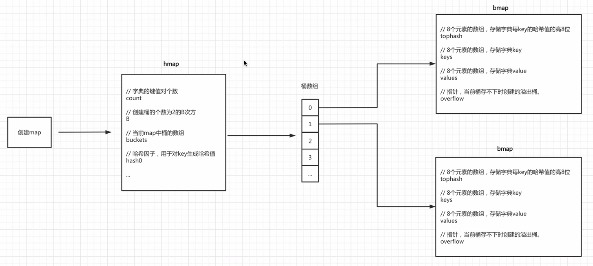

> 本篇的源码分析基于golang 1.19.2
>
> https://github.com/golang/go

# map的底层数据结构

golang map底层有两个核心的结构体实现，hmap和bmap，bmap本篇用桶代替。

makemap

# 根据key快速寻址获取value

golang的map寻址之所以效率高，得益于下面的三个巧妙设计：

## （1）key hash值的后B位作为桶index查找桶

## （2）key hash值的前8位作为桶内结构体的三个数组（tophash，key，value）的index

## （3）桶结构体的tophash复用，既作为tophash使用，也作为标志位使用
